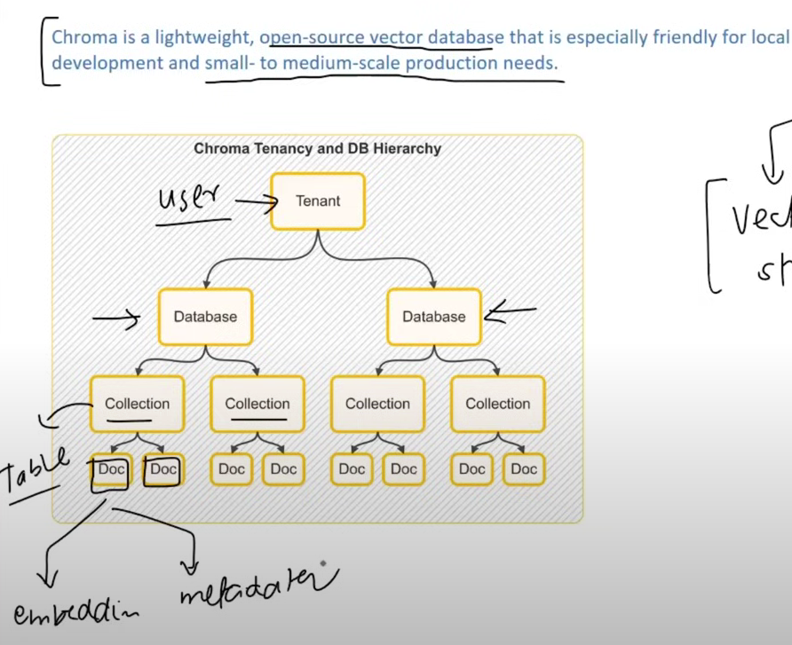

# Vector Store vs Vector DB

- **Vector Store**: Lightweight system that provides storage and retrieval for vector embeddings.
- **Vector DB**: Vector store **plus** traditional database features like concurrency, persistence, filtering, etc.

---

## ChromaDB

ChromaDB is one of the lightweight vector databases.

